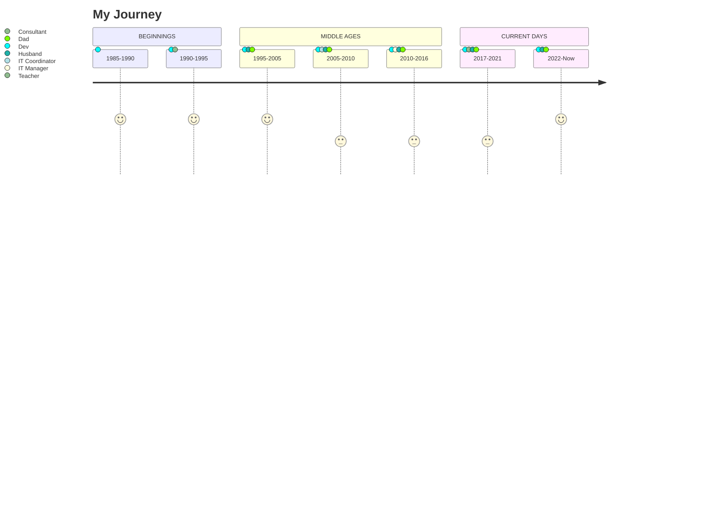

# Hi, I'm Jander.

> In this commomplace you call "real life", I'm a kind of... `Dev`?!


### Some skills


<div style="display: inline">
   <a href="https://azure.microsoft.com/pt-br/products/devops">
      
   </a>
   
</div>
          
### Projects Roadmap (just hobby)
|Project Description|Status|Planned Date|
|-|-|-|
|Spacetime tunnel to resistance base|Approved|Christmas 2150|
|Millennium Falcon III shield upgrade|Approved|Easter 2243|
|Maverick-1 (nickname for R2D4) kernel upgrade with PyScript (_the BB series was discontinued due to suspicious conduct and bad influence on humans_)|Under analysis|not defined|
|~~A way to stop NWO and make the world free~~|~~_No viability_~~|~~_not defined_~~|



### I'm here!
> Finally, let me know when you're near this region. Maybe we can share our stories (and codes) in person... and without masks!

```geojson
{
  "type": "FeatureCollection",
  "features": [
    {
      "type": "Feature",
      "id": 1,
      "properties": {
        "ID": 0
      },
      "geometry": {
        "type": "Point",
        "coordinates": [-41.80591,-22.40200]
      }
    }
  ]
}
```

<!---
        "coordinates": [-41.80591,-22.40200]

```geojson
{
  "type": "FeatureCollection",
  "features": [
    {
      "type": "Feature",
      "id": 1,
      "properties": {
        "ID": 0
      },
      "geometry": {
        "type": "Polygon",
        "coordinates": [
          [
              [-90,35],
              [-90,30],
              [-85,30],
              [-85,35],
              [-90,35]
          ]
        ]
      }
    }
  ]
}
```
--->

<!---
janderssilva/janderssilva is a ✨ special ✨ repository because its `README.md` (this file) appears on your GitHub profile.
You can click the Preview link to take a look at your changes.

--->
